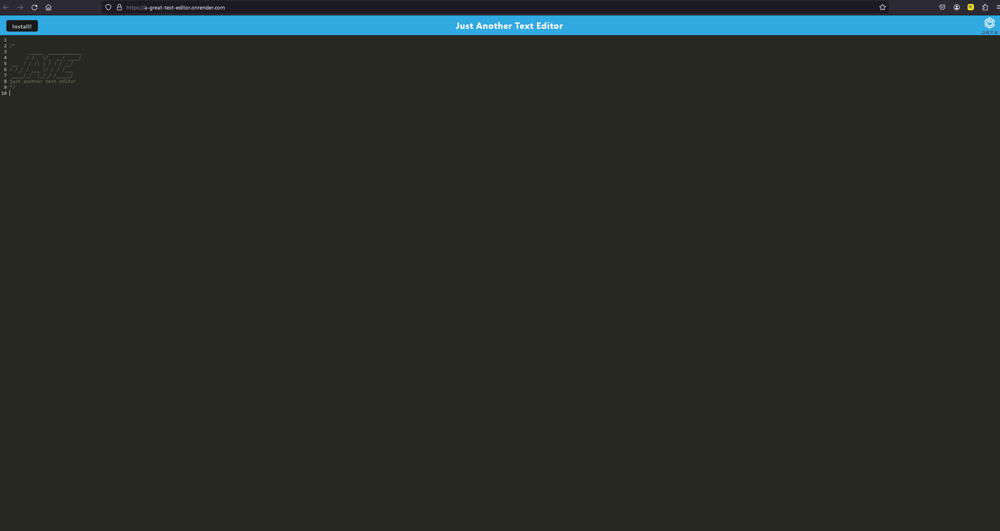

# A-Great-Text-Editor

## User Story

AS A student

I WANT to build a fully functional web application to save notes

SO THAT anyone can use the app without wifi

## Acceptance Criteria

GIVEN a that the text editor is fully functionable

WHEN I successfully run npm run build it builds a working app

WHEN I successfully run npm run start:dev it launches the app in a sleceted port

WHEN I deploy to render and the app deploys with a link

WHEN the app stores the notes you type in and stays after you reload it

## Deployed Link

https://a-great-text-editor.onrender.com/

## Website Screenshot

